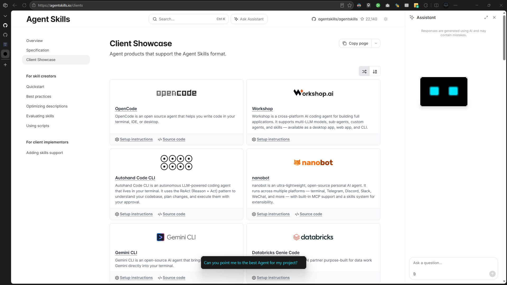
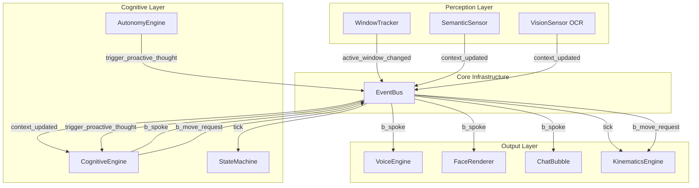
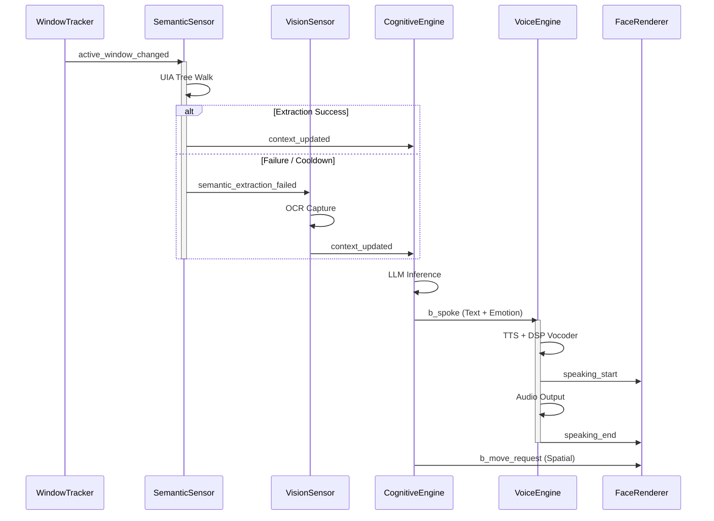
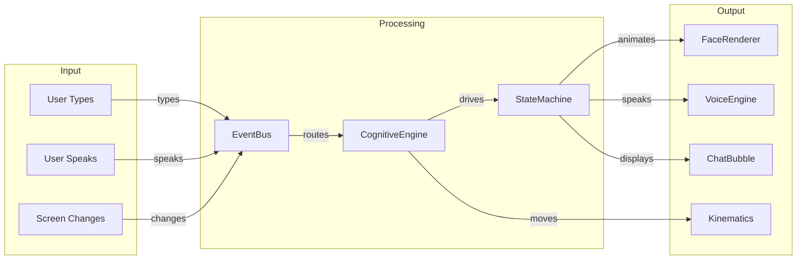
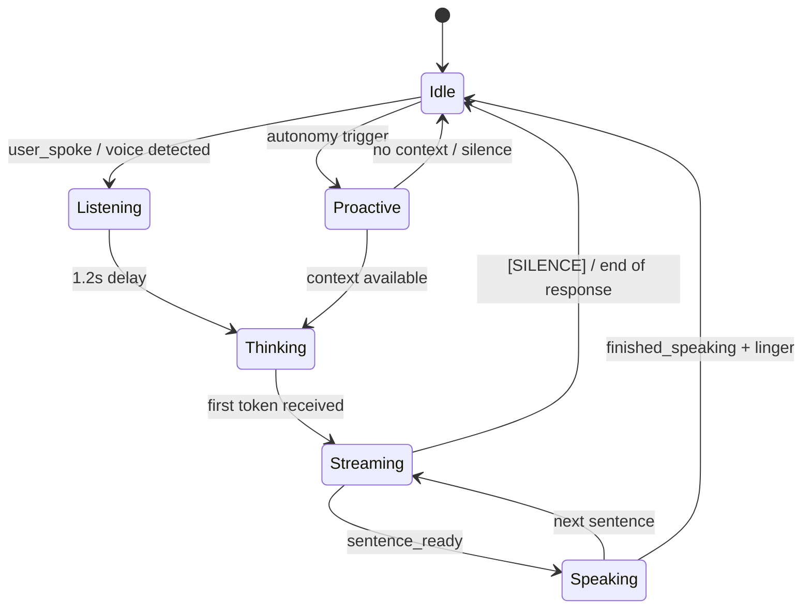
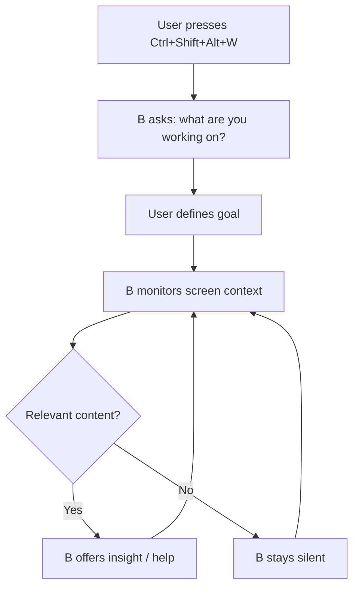

<div align="center">



# ─── B ───
### *The Soul-Wired Desktop Companion*

[](https://python.org)
[](https://www.qt.io/)
[](LICENSE)
[](PRIVACY.md)
[](https://github.com/Ahmad-Hassan-0/B---desktop-companion)

**B** is not just an AI : he is a digital lifeform designed to live on your desktop. Built with a soul-first architecture, B observes your workflow, listens with neural precision, and interacts through a high-performance, glassmorphic overlay.

[Explore the Vision](#-the-vision) • [Architecture](#-architecture-overview) • [Getting Started](#-installation) • [Contributing](CONTRIBUTING.md) • [Privacy](PRIVACY.md)

</div>

<br>

<div align="center">

## Demo

<video src="docs/assets/demo-video.mp4" controls width="100%" style="max-width: 800px; border-radius: 12px;"></video>

*B in action - watch him observe, think, and respond.*

</div>

---

## The Vision

Traditional assistants wait for a command. **B** waits for a moment.

B is designed as a **proactive desktop companion**. Using a 60fps event-driven central nervous system, B synchronizes his emotional state with your environment. He sees your screen semantically, tracks your active focus, and intervenes only when he has something truly valuable to contribute.

- **Silent by Default** : B respects your deep work state.
- **Emotionally Aware** : A complex internal state machine drives expressions and curiosity.
- **Agentic Autonomy** : B doesn't just respond; he thinks, wonders, and observes.

---

## Architecture Overview

B is built on a **centralized asynchronous pub/sub event bus** : the `EventBus`. Every module communicates exclusively through this bus. No module knows about any other module. This strict decoupling makes the system testable, maintainable, and resilient.



---

## System Workflow

The data flows through B in a deterministic pipeline: **Perception → Cognition → Expression**.



---

## Internal Module Structure

### Core Infrastructure

| Module       | File          | Responsibility                                                                                   |
| :----------- | :------------ | :----------------------------------------------------------------------------------------------- |
| **EventBus** | `core/bus.py` | Thread-safe pub/sub message broker. All inter-module communication flows through this.           |
| **main.py**  | `main.py`     | Boot sequence : instantiates all modules, starts the 60fps tick timer, registers global hotkeys. |

### Perception Layer (Sensors)

| Module             | File                        | Responsibility                                                                                             |
| :----------------- | :-------------------------- | :--------------------------------------------------------------------------------------------------------- |
| **WindowTracker**  | `sensors/window_tracker.py` | Hook-based active window change detection. Fires when the user switches focus.                             |
| **SemanticSensor** | `vision/semantic.py`        | UIA-based DOM/window tree walking. Extracts structured content with quality scoring and adaptive cooldown. |
| **VisionSensor**   | `vision/mss_capture.py`     | OCR fallback pipeline using MSS + Tesseract for frameworks incompatible with UIA.                          |

### Cognitive Layer (The Brain)

| Module              | File                     | Responsibility                                                                                                                       |
| :------------------ | :----------------------- | :----------------------------------------------------------------------------------------------------------------------------------- |
| **CognitiveEngine** | `brain/llm.py`           | LLM inference orchestration (Groq cloud or local llama-cpp). Manages context, history, spatial mapping, and streaming token parsing. |
| **StateMachine**    | `brain/soul.py`          | B's emotional state : blinking, resting, conversing. Real-time stream buffer that parses LLM output into sentences.                  |
| **AutonomyEngine**  | `brain/autonomy_loop.py` | Proactive thought scheduling : decides when B should speak unprompted based on context quality and timing.                           |

### Output Layer (Expression)

| Module               | File                    | Responsibility                                                                                |
| :------------------- | :---------------------- | :-------------------------------------------------------------------------------------------- |
| **VoiceEngine**      | `audio/speaker.py`      | Piper ONNX TTS with DSP vocoder chain (pitch shift, bitcrush, chorus) for robotic modulation. |
| **FaceRenderer**     | `ui/face.py`            | PyQt6 QPainter-based hardware-accelerated face rendering at 60fps.                            |
| **ChatBubble**       | `ui/chat.py`            | Glassmorphic chat overlay that displays B's spoken text.                                      |
| **KinematicsEngine** | `physics/kinematics.py` | Physics-based movement with Bezier path interpolation and easing curves.                      |
| **EarsSensor**       | `audio/ears.py`         | Speech-to-text via Faster-Whisper with neural VAD.                                            |

---

## Data Flow



---

## Request Lifecycle



---

## Project Structure

```
B/
├── main.py                  # Entry point : boot sequence
├── core/
│   └── bus.py               # EventBus : central nervous system
├── brain/
│   ├── llm.py               # CognitiveEngine : LLM inference
│   ├── soul.py              # StateMachine : emotions & stream buffer
│   ├── autonomy_loop.py     # AutonomyEngine : proactive thought
│   ├── context.py           # Context management
│   └── work_mode.py         # Work mode prompt templates
├── vision/
│   ├── semantic.py          # SemanticSensor : UIA extraction
│   └── mss_capture.py       # VisionSensor : OCR fallback
├── sensors/
│   └── window_tracker.py    # WindowTracker : focus detection
├── audio/
│   ├── speaker.py           # VoiceEngine : TTS + DSP
│   └── ears.py              # EarsSensor : STT
├── physics/
│   └── kinematics.py        # KinematicsEngine : movement
├── ui/
│   ├── overlay.py           # WindowManager : transparent overlay
│   ├── face.py              # FaceRenderer : 60fps face
│   ├── chat.py              # ChatBubble : text overlay
│   ├── input_box.py         # InputBox : text input
│   ├── expressions.py       # Expression definitions
│   └── theme.py             # Visual theming
├── models/                  # Local GGUF models (gitignored)
├── voices/                  # Piper ONNX voice models
├── scripts/                 # Setup & download utilities
├── docs/
│   ├── ARCHITECTURE.md      # Detailed architecture docs
│   └── assets/              # Images & diagrams
├── .env                     # API keys (gitignored)
└── requirements.txt         # Python dependencies
```

---

## Core Systems

| System               | Technology                       | Description                                                              |
| :------------------- | :------------------------------- | :----------------------------------------------------------------------- |
| **Cognitive Engine** | `Groq API` / `llama-cpp`         | Cloud or local LLM inference for private, high-speed reasoning.          |
| **Semantic Vision**  | `UIAutomation` + `Tesseract OCR` | B understands the context of your active windows and screen content.     |
| **Neural Hearing**   | `Faster-Whisper`                 | Industry-grade transcription with neural VAD for reliable ears.          |
| **Vocal Synthesis**  | `Piper TTS` + `Pedalboard DSP`   | Low-latency, natural-sounding voice with robotic modulation effects.     |
| **Kinematics**       | `PyQt6 QPropertyAnimation`       | Smooth, 60fps movement with Bezier path interpolation and easing curves. |
| **Event Bus**        | `PyQt6 pyqtSignal`               | Thread-safe pub/sub message broker : the central nervous system.         |

---

## Agentic Work Mode

Activated via `Ctrl+Shift+Alt+W`, Work Mode shifts B into a high-utility state:

- **Semantic Monitoring** : B monitors your progress on tasks in real-time.
- **Contextual Curiosity** : Proactively offers insights, documentation, or suggestions based on your current focus.
- **Minimalist Presence** : Dims facial expressions to minimize distraction while remaining vigilant.



---

## Hotkeys

| Shortcut           | Action                                                                    |
| :----------------- | :------------------------------------------------------------------------ |
| `Ctrl+Shift+Alt+Q` | **Kill switch** : immediately terminates B and releases all system hooks. |
| `Ctrl+Shift+Alt+B` | Toggle input box : type messages to B.                                    |
| `Ctrl+Shift+Alt+V` | Toggle speak mode : talk to B via microphone.                             |
| `Ctrl+Shift+Alt+W` | Toggle work mode : B becomes a proactive assistant.                       |

---

## Installation

1. **Clone the repository**:
   ```bash
   git clone https://github.com/Ahmad-Hassan-0/B---desktop-companion.git
   cd B---desktop-companion
   ```

2. **Set up the environment**:
   ```bash
   python -m venv venv
   venv\Scripts\activate      # Windows
   source venv/bin/activate   # Linux/macOS
   pip install -r requirements.txt
   ```

3. **Configure API keys**:
   ```bash
   cp .env.example .env
   # Edit .env with your Groq API key (get one at https://console.groq.com/)
   ```

4. **Awaken B**:
   ```bash
   python main.py
   ```

---

## Safety

> [!CAUTION]
> **Global Kill Switch**: `Ctrl+Shift+Alt+Q`
> This hotkey immediately terminates B and releases all system hooks. Use this if B becomes over-eager or if you need an instant exit.

Because B lives on a transparent, click-through overlay without a standard close button, the kill switch is the only way to exit. It is registered at the Win32 level and works even if the Qt event loop is unresponsive.

---

## Technical Constraints

| Constraint    | Target                                              |
| :------------ | :-------------------------------------------------- |
| **CPU**       | Intel i5 (Quad-Core) or equivalent                  |
| **RAM**       | 16 GB                                               |
| **Display**   | Any resolution (adaptive)                           |
| **OS**        | Windows 10/11 (primary), Linux/macOS (experimental) |
| **Tick Rate** | 60 fps (16ms interval)                              |
| **Inference** | Groq API (cloud) or llama-cpp (local, 4GB+ model)   |

---

<div align="center">

Built by [Ahmad Hassan](https://github.com/Ahmad-Hassan-0)

*Wiring the soul, one tick at a time.*

</div>