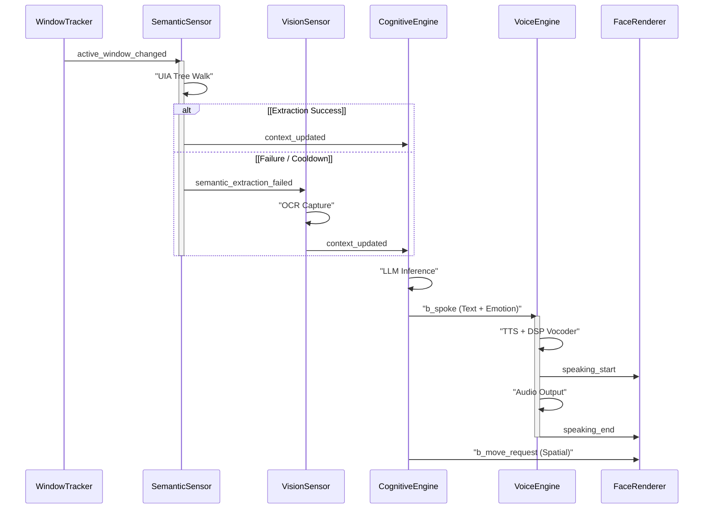

# SYSTEM ARCHITECTURE MANIFEST: B-COMPANION (v3.2)

## 1. ORCHESTRATION LAYER (EDA)
*   **Architectural Pattern**: Centralized Asynchronous Pub/Sub (Publish/Subscribe) Event Bus.
*   **Decoupling Strategy**: Strict separation of concerns via `EventBus` message brokerage; Sensors, Cognitive Engines, and UI Renderers maintain zero direct dependency.
*   **Concurrency Model**: Multi-threaded execution via `QThreads` and `threading.Event` synchronization primitives to prevent blocking of the high-frequency UI tick-timer (16ms).
*   **Event Lifecycle**: Deterministic event propagation with prioritized subscribers to ensure latency-sensitive modules (Physics/UI) process state changes before high-latency modules (Inference).

## 2. PERCEPTION PIPELINE (SENSOR FUSION)

*   **Semantic Extraction Layer**: UIA-based DOM/Tree-walking via Windows UIAutomation (UIA). Utilizes `TextPattern` and `ValuePattern` for structured buffer acquisition with minimal CPU overhead.
*   **Adaptive Fault Tolerance**: Proactive framework-detection with **Smart Cooldown Probing**. 
    *   **Heuristic Gating**: Extraction quality (Q-score) is evaluated via lexical variety and UI-chrome density analysis.
    *   **Backoff Logic**: Processes triggering consecutive low-quality failures (<0.1) enter a `cooldown_until` state with exponential backoff (60s → 300s).
*   **Deterministic Fallback**: Secondary pipeline routes to the **MSS/Tesseract OCR Stack**. Screen geometry is captured via MSS and processed through a deterministic OCR engine to reconstruct spatial context when UIA-incompatible frameworks are encountered.
*   **MD5 Deduplication**: Content hashes are compared post-extraction to suppress redundant downstream processing if the window state is static.

## 3. COGNITIVE ENGINE (THE BRAIN)

*   **Inference Orchestration**: Asynchronous Inference Loop supporting GGUF-quantized local models (Llama-cpp) and High-Throughput Cloud APIs (Groq/Gemini 3 Flash).
*   **Contextual Fusion**: 
    *   **Spatial Mapping**: Real-time mapping of screen-element UIA `RuntimeId` to normalized global (x, y) coordinates.
    *   **Temporal Memory**: Sliding window buffer for user-intent history and active goal persistence.
*   **Token Stream Parser**: 
    *   **Reactive Tagging**: Regex-based extraction of `[EMOTION]` lexical markers for synchronized face-morphed transitions.
    *   **Idempotent Navigation**: State-tracked `<MOVE:id>` parser ensuring singular physical actuation per inference turn, preventing "double-tap" movement collisions.

## 4. KINEMATICS & UI PRESENTATION

*   **Asynchronous Rendering Engine**: PyQt6 `QPainter`-based hardware-accelerated face-rendering engine. Decoupled from logic to maintain consistent 60FPS fluid motion.
*   **Coordinate Translation**: 
    *   **Global-to-Local Mapping**: Translates 2D screen-space coordinates (Global Screen Space) to the transparent overlay's local `ViewPort` (Local Widget Space).
*   **Kinematic Animation Pipeline**: 
    *   **Non-Linear Actuation**: Utilizes `QPropertyAnimation` with custom Easing Curves (InOutQuad/OutBack) to simulate organic, acceleration-aware movement.
    *   **Physics Interpolation**: Bezier-path interpolation for companion transit towards target nodes, preventing linear "robotic" jitter.

## 5. AUDIO / OUTPUT PIPELINE

*   **TTS Pipeline**: Localized speech generation using **Piper ONNX** models for high-fidelity, deterministic synthesis with minimal latency.
*   **DSP Vocoder Chain**: Real-time robotic modulation via `Pedalboard`. Processes raw audio through a serial chain of **PitchShift**, **Bitcrush**, and **Chorus** filters to achieve a stylized mechanical texture.
*   **Emotional Pitch Modulation**: Dynamic parameter injection into the Vocoder chain based on the `[EMOTION]` tag context (e.g., high-frequency modulation for `[EXCITED]`, low-frequency for `[ANGRY]`).

## 6. SYSTEM CONSTRAINTS & OPTIMIZATION

*   **Architecture Targets**: Optimized for **Intel i5 (Quad-Core)** consumer-grade silicon. 
*   **CPU-Bound Optimization**: Offloads heavy inference and DSP processing to background workers, preserving the primary UI thread for 60Hz presentation stability.
*   **RAM Management**: Engineered for **16GB environments**. Employs aggressive buffer pruning, sliding-window context truncation, and shared memory-mapping for ONNX/GGUF weights.

## 7. DATA FLOW & PIPELINE (UML)

